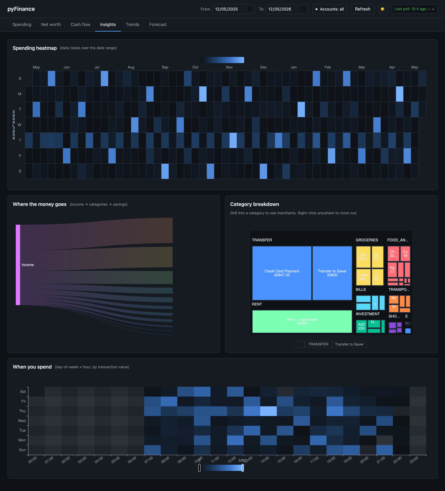
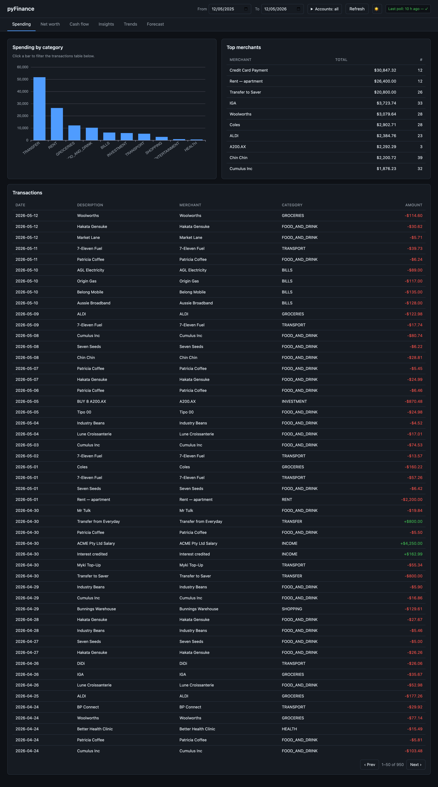
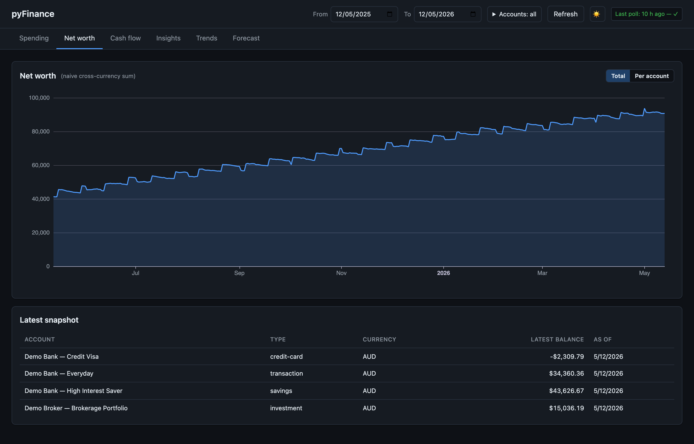
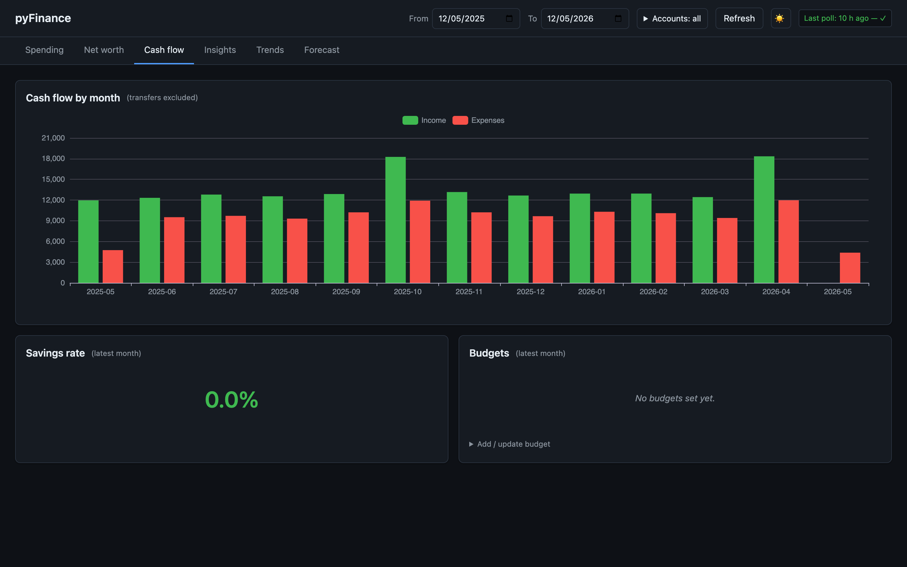
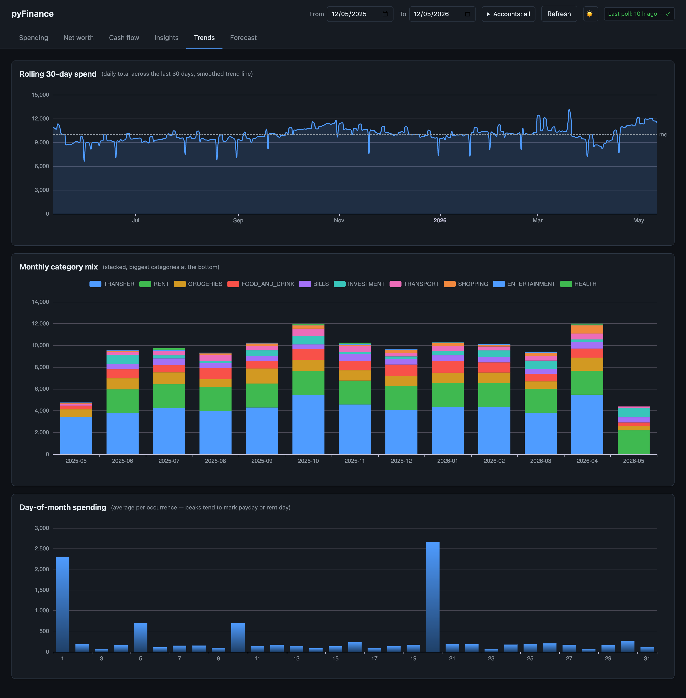
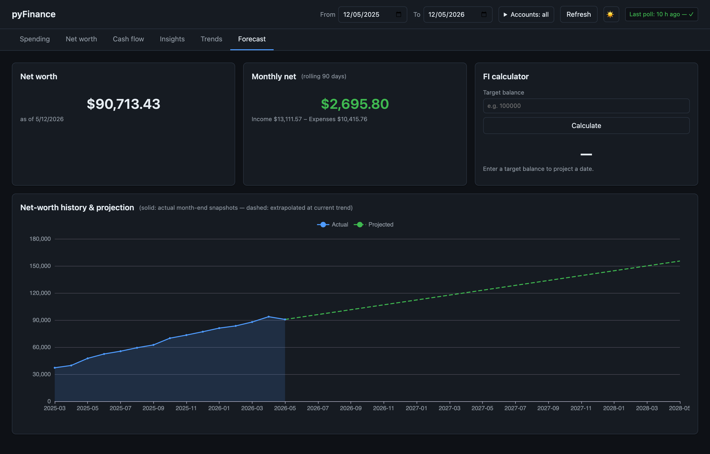

# OpenBanking Finance v2

Self-hosted personal finance dashboard for Australian bank and brokerage accounts. Syncs via [Redbark](https://docs.redbark.co/) (open-banking + brokerage), stores everything in a local SQLite database, and renders six tabs of charts — spending, net worth, cash flow, insights, trends, and a financial-independence forecast. One process, no build step, no third party sees your data after the sync hop.



## Screenshots

All six tabs, captured against a generated demo dataset (see [`scripts/seed_demo.py`](scripts/seed_demo.py)). Dark and light themes are both supported.

| Tab | Preview |
| --- | --- |
| **Spending** — by-category, top merchants, scrollable transaction log |  |
| **Net worth** — total + per-account, balance snapshots over time |  |
| **Cash flow** — monthly income vs spend, budget editor |  |
| **Insights** — calendar heatmap, income→category sankey, treemap, day-of-week × hour heatmap |  |
| **Trends** — rolling 30-day spend, monthly category mix, day-of-month |  |
| **Forecast** — net-worth projection and FI calculator |  |

## Stack

- **FastAPI** + **uvicorn** — JSON API + static dashboard files
- **SQLite** (WAL) via **SQLModel**
- **APScheduler** — in-process poller (15-minute interval, in the FastAPI event loop)
- **httpx** — async Redbark REST client (rate-limit aware, 4-concurrent semaphore for heavy endpoints)
- **Apache ECharts** (CDN) — bespoke vanilla HTML/JS dashboard, no build step
- **pydantic-settings** + **python-dotenv** — config

Pinned to **Python 3.12**. `uv` is used if available; otherwise pip + venv.

## Setup

```bash
make install
cp .env.example .env
# edit .env and set REDBARK_API_KEY=...
```

Get an API key from your Redbark account (Developer or Professional plan required for API access).

## Run

```bash
# API + scheduler (combined process)
make api

# One-off historical backfill (default: 2 years back)
make backfill ARGS="--from 2024-01-01"

# Backfill a single account, skipping trades
make backfill ARGS="--from 2024-01-01 --account-id <uuid> --no-trades"
```

The dashboard is at <http://localhost:8000/>. JSON endpoints live under `/api/`.

## Suggested workflow on first install

1. `make install`
2. Set `REDBARK_API_KEY` in `.env`
3. Run `make api` once so the DB is created and the first poll populates connections + accounts. Stop after one poll cycle (15 min) or use `python -m app.poller --once`.
4. Run `make backfill ARGS="--from 2024-01-01"` to pull two years of history. After backfill, the per-account watermarks are advanced to "now" so the regular poller will not re-fetch history.
5. Restart `make api` and let the scheduler take over.

## Editing budgets

```bash
curl -X POST http://localhost:8000/api/budgets \
    -H "Content-Type: application/json" \
    -d '{"category": "FOOD_AND_DRINK", "monthly_limit": "800.00", "currency": "AUD"}'
```

Or use the Cash flow tab — budget editing is wired into the dashboard.

## Development

```bash
make check       # lint + typecheck + tests
make fmt         # ruff format + autofix
make test        # pytest only
make typecheck   # mypy --strict
make lint        # ruff check
```

## Architecture notes

- **Watermarks**: each account has `last_polled_transactions_at` and `last_polled_trades_at`. Each poll requests `from = watermark - 24h` so late-posting / re-categorised rows refresh. Idempotent merge on provider ID prevents duplicates.
- **Rate limits**: heavy endpoints (`/transactions`, `/trades`, `/holdings`) are gated by an `asyncio.Semaphore(4)`. The client self-throttles when `X-RateLimit-Remaining` drops below 5 and respects `Retry-After` on 429s.
- **Truncation**: `X-Redbark-Truncated: true` is logged but does not stop pagination — the loop keeps requesting the next offset.
- **Money**: Decimal end-to-end. JSON serialisation emits Decimals as strings.

## Limitations

- Single-user, single-machine. No auth on the dashboard.
- SQLite — fine for one user, not suitable for multi-tenant.

## Demo data + screenshots

The screenshots above come from a generated dataset, not real bank data. To regenerate:

```bash
# Seed a fresh demo.db (~14 months of plausible transactions, balances, trades)
DATABASE_URL=sqlite:///./demo.db PYTHONPATH=. uv run python scripts/seed_demo.py

# Serve the dashboard against demo.db with the poller disabled
PYTHONPATH=. uv run python scripts/serve_demo.py    # → http://127.0.0.1:8765/

# Capture all six tabs in both themes via Playwright + system Chrome
PYTHONPATH=. uv run python scripts/capture_screenshots.py
```
